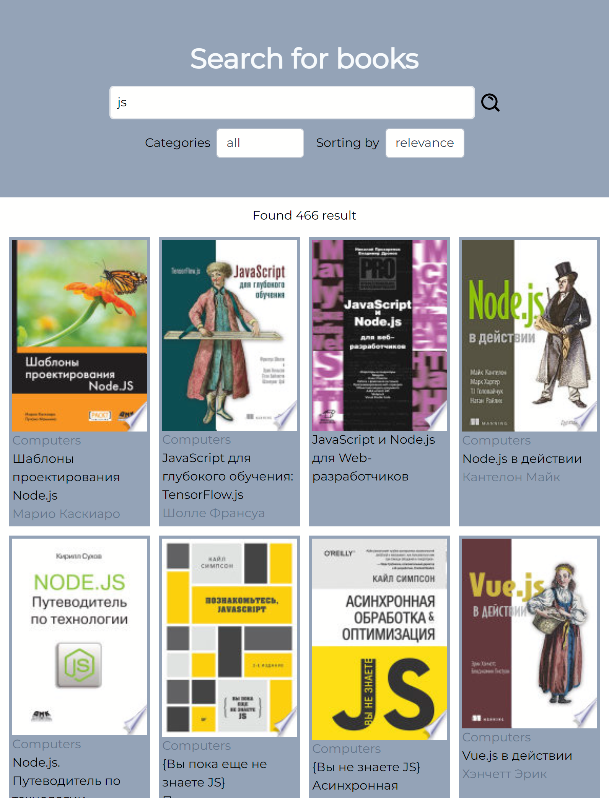
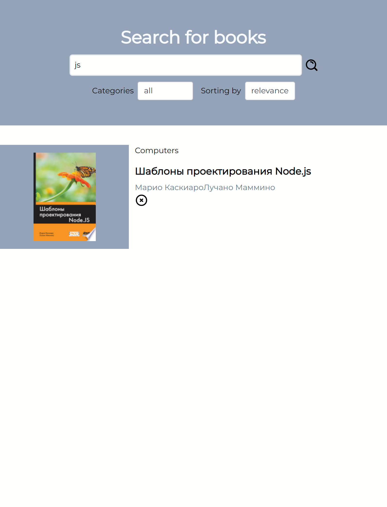

# Books searcher

_This project used this technology's:
react + mobx + tailwind_

U can open this app on that [link](https://google-books-b4eixmr20-jointime1.vercel.app/)

## What we can do whith this app?

> We can find any book, which we want
> We can sort results by categories or by time (relevance or newest)

### Examples

_There is examples below_

### Main page

### Chosen card

